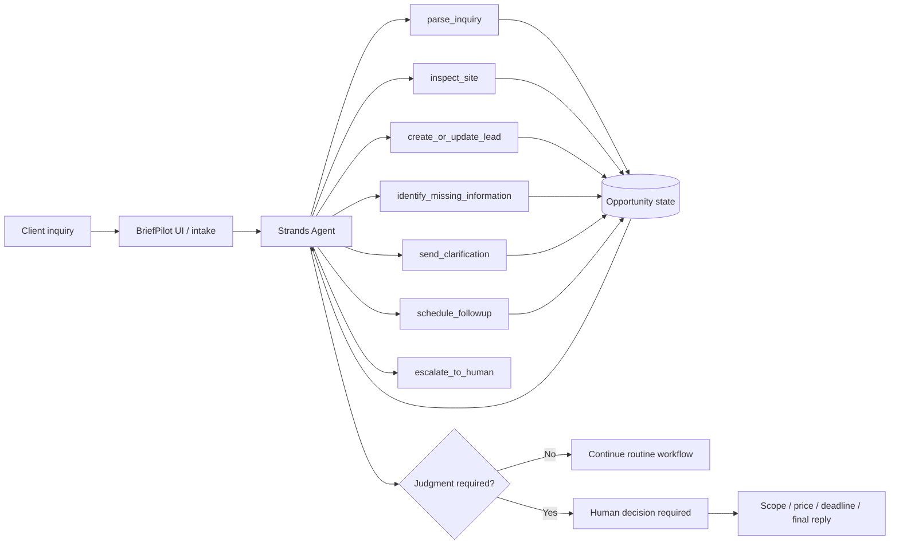

# Architecture draft

## Zero-cost scaffold

Current implementation:
- Python core logic
- Local JSON state
- Deterministic demo fixture
- Strands integration isolated and disabled by default

No AWS model or runtime call occurs in this stage.

## Target final implementation

- **Agent framework:** AWS Strands Agents
- **Model provider:** Amazon Bedrock
- **State:** local JSON initially; optional DynamoDB if useful
- **Frontend:** React + TypeScript
- **Deployment:** live web demo
- **Stretch:** Amazon Bedrock AgentCore Runtime

## Safety boundary

BriefPilot may autonomously perform routine intake actions, but must escalate before:
- committing a price;
- confirming final scope;
- committing a deadline;
- sending a final commercial proposal;
- making irreversible external changes.
